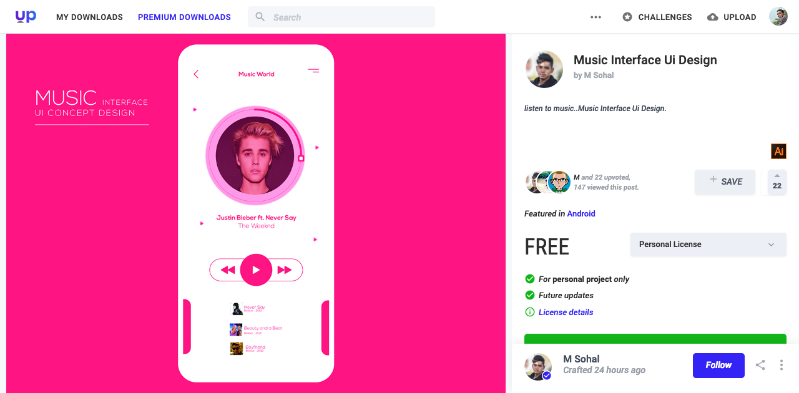
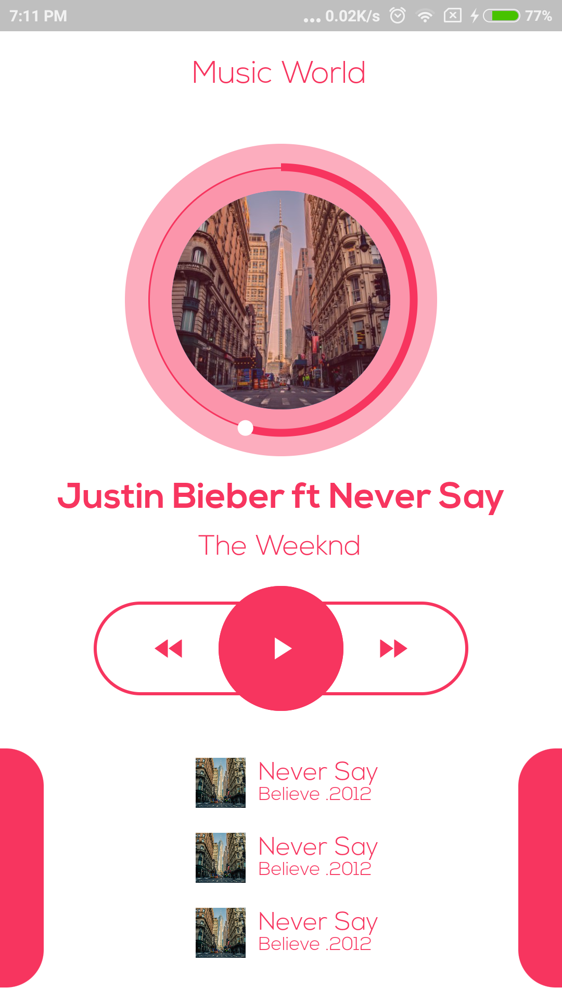

# music_ui_desing

A new Flutter Project for recreating UI shown in [here](https://www.uplabs.com/posts/music-interface-ui-design).

#### Download the demo apk from [here](docs/music-design-demo.apk)

## Aim
The aim of the project is to design and build the ui shown [here](https://www.uplabs.com/posts/music-interface-ui-design).

Demo Video Can be found [here](docs/recording.mp4)

TO DO:
- Add theme valiables